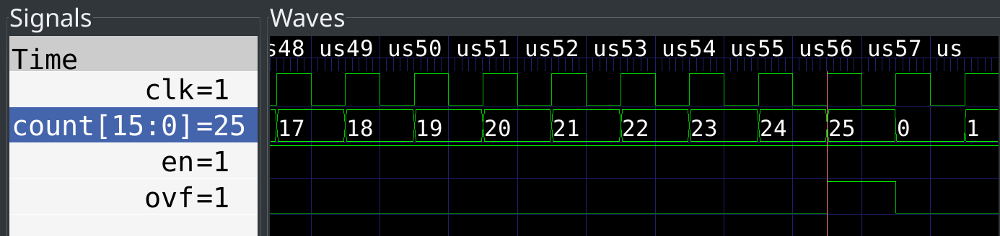

Getting started
###############

This section demonstrates the basic Amaranth workflow to provide a cursory overview of the language and the toolchain. See the :doc:`tutorial <tutorial>` for a step-by-step introduction to the language, and the :doc:`language guide <lang>` for a detailed explanation of every language construct.

.. TODO: add link to build system doc
.. TODO: add link to more complex examples?

A counter
=========

As a first example, consider a counter with a fixed limit, enable, and overflow. The code for this example is shown below. :download:`Download <_code/up_counter.py>` and run it:

.. code-block:: shell

   $ python3 up_counter.py

Implementing a counter
----------------------

A 16-bit up counter with enable input, overflow output, and a limit fixed at design time can be implemented in Amaranth as follows:

.. literalinclude:: _code/up_counter.py
   :linenos:
   :lineno-match:
   :end-before: # --- TEST ---

The reusable building block of Amaranth designs is an ``Elaboratable``: a Python class that includes HDL signals (``en`` and ``ovf``, in this case) as a part of its interface, and provides the ``elaborate`` method that defines its behavior.

.. TODO: link to Elaboratable reference

Most ``elaborate`` implementations use a ``Module`` helper to describe combinatorial (``m.d.comb``) and synchronous (``m.d.sync``) logic controlled with conditional syntax (``m.If``, ``m.Elif``, ``m.Else``) similar to Python's. They can also instantiate vendor-defined black boxes or modules written in other HDLs.

.. TODO: link to DSL reference

Testing a counter
-----------------

To verify its functionality, the counter can be simulated for a small amount of time, with a test bench driving it and checking a few simple conditions:

.. literalinclude:: _code/up_counter.py
   :linenos:
   :lineno-match:
   :start-after: # --- TEST ---
   :end-before: # --- CONVERT ---

The test bench is implemented as a Python generator function that is co-simulated with the counter itself. The test bench can inspect the simulated signals with ``yield sig``, update them with ``yield sig.eq(val)``, and advance the simulation by one clock cycle with ``yield``.

.. TODO: link to simulator reference

When run, the test bench finishes successfully, since all of the assertions hold, and produces a VCD file with waveforms recorded for every ``Signal`` as well as the clock of the ``sync`` domain:

Converting a counter
--------------------

Although some Amaranth workflows do not include Verilog at all, it is still the de facto standard for HDL interoperability. Any Amaranth design can be converted to synthesizable Verilog using the corresponding backend:

.. literalinclude:: _code/up_counter.py
   :linenos:
   :lineno-match:
   :start-after: # --- CONVERT ---

The signals that will be connected to the ports of the top-level Verilog module should be specified explicitly. The rising edge clock and synchronous reset signals of the ``sync`` domain are added automatically; if necessary, the control signals can be configured explicitly. The result is the following Verilog code (lightly edited for clarity):

.. TODO: link to clock domain section of language reference

.. literalinclude:: _code/up_counter.v
	 :language: verilog
	 :linenos:

To aid debugging, the generated Verilog code has the same general structure as the Amaranth source code (although more verbose), and contains extensive source location information.

.. note::

   Unfortunately, at the moment none of the supported toolchains will use the source location information in diagnostic messages.

A blinking LED
==============

Although Amaranth works well as a standalone HDL, it also includes a build system that integrates with FPGA toolchains, and many board definition files for common developer boards that include pinouts and programming adapter invocations. The following code will blink a LED with a frequency of 1 Hz on any board that has a LED and an oscillator:

.. literalinclude:: _code/led_blinker.py
   :linenos:
   :lineno-match:
   :end-before: # --- BUILD ---

The ``LEDBlinker`` module will use the first LED available on the board, and derive the clock divisor from the oscillator frequency specified in the clock constraint. It can be used, for example, with the `Lattice iCEStick evaluation board <https://www.latticesemi.com/icestick>`_, one of the many boards already supported by Amaranth:

.. TODO: link to list of supported boards

.. todo::

	 Link to the installation instructions for the FOSS iCE40 toolchain, probably as a part of board documentation.

.. literalinclude:: _code/led_blinker.py
   :linenos:
   :lineno-match:
   :start-after: # --- BUILD ---

With only a single line of code, the design is synthesized, placed, routed, and programmed to the on-board Flash memory. Although not all applications will use the Amaranth build system, the designs that choose it can benefit from the "turnkey" built-in workflows; if necessary, the built-in workflows can be customized to include user-specified options, commands, and files.

.. TODO: link to build system reference

.. note::

   The ability to check with minimal effort whether the entire toolchain functions correctly is so important that it is built into every board definition file. To use it with the iCEStick board, run:

   .. code-block:: shell

      $ python3 -m amaranth_boards.icestick

   This command will build and program a test bitstream similar to the example above.
