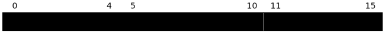

Data structures
###############

.. py:module:: amaranth.lib.data

The :mod:`amaranth.lib.data` module provides a way to describe the bitwise layout of values and a proxy class for accessing fields of values using the attribute access and indexing syntax.

Introduction
============

Overview
++++++++

This module provides four related facilities:

1. Low-level bitwise layout description via :class:`Field` and :class:`Layout`. These classes are rarely used directly, but are the foundation on which all other functionality is built. They are also useful for introspection.
2. High-level bitwise layout description via :class:`StructLayout`, :class:`UnionLayout`, :class:`ArrayLayout`, and :class:`FlexibleLayout`. These classes are the ones most often used directly, in particular :class:`StructLayout` and :class:`ArrayLayout`.
3. Data views via :class:`View` or its user-defined subclasses. This class is used to apply a layout description to a plain :class:`Value`, enabling structured access to its bits.
4. Data classes :class:`Struct` and :class:`Union`. These classes are data views with a layout that is defined using Python :term:`variable annotations <python:variable annotation>` (also known as type annotations).

Motivation
++++++++++

The fundamental Amaranth type is a :class:`Value`: a sequence of bits that can also be used as a number. Manipulating values directly is sufficient for simple applications, but in more complex ones, values are often more than just a sequence of bits; they have well-defined internal structure.

.. testsetup::

    from amaranth import *
    m = Module()

For example, consider a module that processes pixels, converting them from RGB to grayscale. The color pixel format is RGB565:

This module could be implemented (using a fast but *very* approximate method) as follows:

.. testcode::

    i_color = Signal(16)
    o_gray  = Signal(8)

    m.d.comb += o_gray.eq((i_color[0:5] + i_color[5:11] + i_color[11:16]) << 1)

While this implementation works, it is repetitive, error-prone, hard to read, and laborous to change; all because the color components are referenced using bit offsets. To improve it, the structure can be described with a :class:`Layout` so that the components can be referenced by name:

.. testcode::

    from amaranth.lib import data, enum

    rgb565_layout = data.StructLayout({
        "red":   5,
        "green": 6,
        "blue":  5
    })

    i_color = Signal(rgb565_layout)
    o_gray  = Signal(8)

    m.d.comb += o_gray.eq((i_color.red + i_color.green + i_color.blue) << 1)

The :class:`View` is :ref:`value-castable <lang-valuecasting>` and can be used anywhere a plain value can be used. For example, it can be assigned to in the usual way:

.. testcode::

    m.d.comb += i_color.eq(0) # everything is black

Composing layouts
+++++++++++++++++

Layouts are composable: a :class:`Layout` is a :ref:`shape <lang-shapes>` and can be used as a part of another layout. In this case, an attribute access through a view returns a view as well.

For example, consider a module that processes RGB pixels in groups of up to four at a time, provided by another module, and accumulates their average intensity:

.. testcode::

    input_layout = data.StructLayout({
        "pixels": data.ArrayLayout(rgb565_layout, 4),
        "valid":  4
    })

    i_stream = Signal(input_layout)
    r_accum  = Signal(32)

    m.d.sync += r_accum.eq(
        r_accum + sum((i_stream.pixels[n].red +
                       i_stream.pixels[n].green +
                       i_stream.pixels[n].blue)
                      * i_stream.valid[n]
                      for n in range(len(i_stream.valid))))

Note how the width of ``i_stream`` is never defined explicitly; it is instead inferred from the shapes of its fields.

In the previous section, the precise bitwise layout was important, since RGB565 is an interchange format. In this section however the exact bit positions do not matter, since the layout is only used internally to communicate between two modules in the same design. It is sufficient that both of them use the same layout.

Defining layouts
++++++++++++++++

Data layouts can be defined in a few different ways depending on the use case.

In case the data format is defined using a family of layouts instead of a single specific one, a function can be used:

.. testcode::

    def rgb_layout(r_bits, g_bits, b_bits):
        return data.StructLayout({
            "red":   unsigned(r_bits),
            "green": unsigned(g_bits),
            "blue":  unsigned(b_bits)
        })

    rgb565_layout = rgb_layout(5, 6, 5)
    rgb24_layout  = rgb_layout(8, 8, 8)

In case the data has related operations or transformations, :class:`View` can be subclassed to define methods implementing them:

.. testcode::

    class RGBLayout(data.StructLayout):
        def __init__(self, r_bits, g_bits, b_bits):
            super().__init__({
                "red":   unsigned(r_bits),
                "green": unsigned(g_bits),
                "blue":  unsigned(b_bits)
            })

        def __call__(self, value):
            return RGBView(self, value)

    class RGBView(data.View):
        def brightness(self):
            return (self.red + self.green + self.blue)[-8:]

Here, the ``RGBLayout`` class itself is :ref:`shape-castable <lang-shapecasting>` and can be used anywhere a shape is accepted. When a :class:`Signal` is constructed with this layout, the returned value is wrapped in an ``RGBView``:

.. doctest::

   >>> pixel = Signal(RGBLayout(5, 6, 5))
   >>> len(pixel.as_value())
   16
   >>> pixel.red
   (slice (sig pixel) 0:5)

In case the data format is static, :class:`Struct` (or :class:`Union`) can be subclassed instead of :class:`View`, to reduce the amount of boilerplate needed:

.. testcode::

    class IEEE754Single(data.Struct):
        fraction: 23
        exponent:  8 = 0x7f
        sign:      1

        def is_subnormal(self):
            return self.exponent == 0

Discriminated unions
++++++++++++++++++++

This module provides a :class:`UnionLayout`, which is rarely needed by itself, but is very useful in combination with a *discriminant*: a enumeration indicating which field of the union contains valid data.

For example, consider a module that can direct another module to perform one of a few operations, each of which requires its own parameters. The two modules could communicate through a channel with a layout like this:

.. testcode::

    class Command(data.Struct):
        class Kind(enum.Enum):
            SET_ADDR  = 0
            SEND_DATA = 1

        valid  : 1
        kind   : Kind
        params : data.UnionLayout({
            "set_addr": data.StructLayout({
                "addr": unsigned(32)
            }),
            "send_data": data.StructLayout({
                "byte": unsigned(8)
            })
        })

Here, the shape of the ``Command`` is inferred, being large enough to accommodate the biggest of all defined parameter structures, and it is not necessary to manage it manually.

One module could submit a command with:

.. testcode::

    cmd = Signal(Command)

    m.d.comb += [
        cmd.valid.eq(1),
        cmd.kind.eq(Command.Kind.SET_ADDR),
        cmd.params.set_addr.addr.eq(0x00001234)
    ]

The other would react to commands as follows:

.. testcode::

    addr = Signal(32)

    with m.If(cmd.valid):
        with m.Switch(cmd.kind):
            with m.Case(Command.Kind.SET_ADDR):
                m.d.sync += addr.eq(cmd.params.set_addr.addr)
            with m.Case(Command.Kind.SEND_DATA):
               ...

Modeling structured data
========================

.. autoclass:: Field
.. autoclass:: Layout

Common data layouts
===================

.. autoclass:: StructLayout
.. autoclass:: UnionLayout
.. autoclass:: ArrayLayout
.. autoclass:: FlexibleLayout

Data views
==========

.. autoclass:: View

Data classes
============

.. autoclass:: Struct
.. autoclass:: Union
