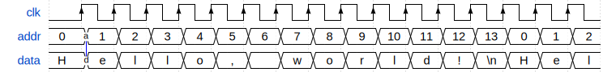

Memory arrays
-------------

.. todo::

    - add second waveform diagram

.. py:module:: amaranth.lib.memory

The :mod:`amaranth.lib.memory` module provides a way to efficiently store data organized as an array of identically shaped rows, which may be addressed (read and/or written) one at a time. This organization is well suited for an efficient implementation in hardware.

Introduction
============

A memory :ref:`component <wiring-introduction>` is accessed through read and write *memory ports*, which are :ref:`interface objects <wiring-introduction>` with address, data, and enable ports. The address input selects the memory row to be accessed, the enable input determines whether an access will be made, and the data output (for read ports) or data input (for write ports) transfers data between the memory row and the rest of the design. Read ports can be synchronous (where the memory row access is triggered by the :ref:`active edge <lang-sync>` of a clock) or asynchronous (where the memory row is accessed continuously); write ports are always synchronous.

.. note::

    Unfortunately, the terminology related to memories has an ambiguity: a "port" could refer to either an *interface port* (:class:`.Signal` objects created by the :mod:`amaranth.lib.wiring` module) or to a *memory port* (:class:`ReadPort` or :class:`WritePort` object created by :class:`amaranth.lib.memory.Memory`).

    Amaranth documentation always uses the term "memory port" when referring to the latter.

To use a memory, first create a :class:`Memory` object, providing a shape, depth (the number of rows), and initial contents. Then, request as many memory ports as the number of concurrent accesses you need to perform by using the :meth:`Memory.read_port` and :meth:`Memory.write_port` methods.

.. warning::

    While :class:`Memory` will provide virtually any memory configuration on request and all will simulate correctly, only a subset of configurations can implemented in hardware efficiently or `at all`. Exactly what any given hardware platform supports is specific to both the device and the toolchain used.

    However, the following two configurations are well-supported on most platforms:

    1. Zero or one write ports and any amount of read ports. Almost all devices include one or two read ports in a hardware memory block, but the toolchain will replicate memory blocks as needed to meet the requested amount of read ports, using more resources.
    2. Two write ports and any amount of read ports whose address input always matches that of the either write port. Most devices include two combined read/write ports in a hardware memory block (known as "true dual-port", or "TDP", block RAM), and the toolchain will replicate memory blocks to meet the requested amount of read ports. However, some devices include one read-only and one write-only port in a hardware memory block (known as "simple dual-port", or "SDP", block RAM), making this configuration unavailable. Also, the combined (synchronous) read/write port of a TDP block RAM usually does not have independent read enable and write enable inputs; in this configuration, the read enable input should usually be left in the (default if not driven) asserted state.

    Most devices include hardware primitives that can efficiently implement memories with asynchronous read ports (known as "LUT RAM", "distributed RAM", or "DRAM"; not to be confused with "dynamic RAM", also abbreviated as "DRAM"). On devices without these hardware primitives, memories with asynchronous read ports are implemented using logic resources, which are consumed at an extremely high rate. Synchronous read ports should be always preferred over asynchronous ones.

    Additionally, some memory configurations (that seem like they should be supported by the device and the toolchain) may fail to be recognized, or may use much more resources than they should. This can happen due to device and/or toolchain errata (including defects in Amaranth). Unfortunately, such issues can only be handled on a case-by-case basis; in general, simpler memory configurations are better and more widely supported.

Examples
========

.. testsetup::

    from amaranth import *

First, import the :class:`Memory` class.

.. testcode::

    from amaranth.lib.memory import Memory

In the following example, a read-only memory is used to output a fixed message in a loop:

.. testcode::
    :hide:

    m = Module()

.. testcode::

    message = b"Hello, world!\n"
    m.submodules.memory = memory = \
        Memory(shape=unsigned(8), depth=len(message), init=message)

    rd_port = memory.read_port(domain="comb")
    with m.If(rd_port.addr == memory.depth - 1):
        m.d.sync += rd_port.addr.eq(0)
    with m.Else():
        m.d.sync += rd_port.addr.eq(rd_port.addr + 1)

    character = Signal(8)
    m.d.comb += character.eq(rd_port.data)

In this example, the memory read port is asynchronous, and a change of the address input (labelled `a` on the diagram below) results in an immediate change of the data output (labelled `d`).

In a more complex example, a power-of-2 sized writable memory is used to implement a first-in, first-out queue:

.. testcode::
    :hide:

    m = Module()

.. testcode::

    push = Signal()
    pop  = Signal()

    m.submodules.memory = memory = \
        Memory(shape=unsigned(32), depth=128, init=[])

    wr_port = memory.write_port()
    m.d.comb += wr_port.en.eq(push)
    with m.If(push):
        m.d.sync += wr_port.addr.eq(wr_port.addr + 1)

    rd_port = memory.read_port(transparent_for=(wr_port,))
    m.d.comb += rd_port.en.eq(pop)
    with m.If(pop):
        m.d.sync += rd_port.addr.eq(rd_port.addr + 1)

    # Data can be shifted in via `wr_port.data` and out via `rd_port.data`.
    # This example assumes that empty queue will be never popped from.

In this example, the memory read port is configured to be *transparent* relative to the memory write port. This means that if a write and a read access the same row, the new contents will be read out, reducing the minimum push-to-pop latency by one cycle.

Memories
========

.. autoclass:: Memory(*, depth, shape, init, src_loc_at=0)
    :no-members:

    .. autoclass:: amaranth.lib.memory::Memory.Init(...)

    .. automethod:: read_port

    .. automethod:: write_port

    .. autoproperty:: r_ports

    .. autoproperty:: w_ports

Memory ports
============

.. autoclass:: ReadPort(...)

.. autoclass:: WritePort(...)
