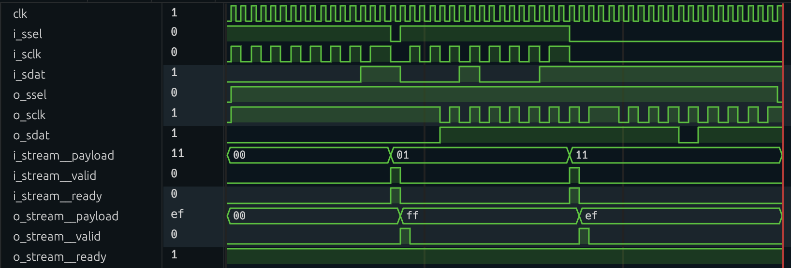

Data streams
------------

.. py:module:: amaranth.lib.stream

The :mod:`amaranth.lib.stream` module provides a mechanism for unidirectional exchange of arbitrary data between modules.

Introduction
============

One of the most common flow control mechanisms is *ready/valid handshaking*, where a *producer* pushes data to a *consumer* whenever it becomes available, and the consumer signals to the producer whether it can accept more data. In Amaranth, this mechanism is implemented using an :ref:`interface <wiring>` with three members:

- :py:`payload` (driven by the producer), containing the data;
- :py:`valid` (driven by the producer), indicating that data is currently available in :py:`payload`;
- :py:`ready` (driven by the consumer), indicating that data is accepted if available.

This module provides such an interface, :class:`stream.Interface <Interface>`, and defines the exact rules governing the flow of data through it.

.. _stream-rules:

Data transfer rules
===================

The producer and the consumer must be synchronized: they must belong to the same :ref:`clock domain <lang-clockdomains>`, and any :ref:`control flow modifiers <lang-controlinserter>` must be applied to both, in the same order.

Data flows through a stream according to the following four rules:

1. On each cycle where both :py:`valid` and :py:`ready` are asserted, a transfer is performed: the contents of ``payload`` are conveyed from the producer to the consumer.
2. Once the producer asserts :py:`valid`, it must not deassert :py:`valid` or change the contents of ``payload`` until a transfer is performed.
3. The producer must not wait for :py:`ready` to be asserted before asserting :py:`valid`: any form of feedback from :py:`ready` that causes :py:`valid` to become asserted is prohibited.
4. The consumer may assert or deassert :py:`ready` at any time, including via combinational feedback from :py:`valid`.

Some producers and consumers may be designed without support for backpressure. Such producers must tie :py:`ready` to :py:`Const(1)` by specifying :py:`always_ready=True` when constructing a stream, and consumers may (but are not required to) do the same. Similarly, some producers and consumers may be designed such that a payload is provided or must be provided on each cycle. Such consumers must tie :py:`valid` to :py:`Const(1)` by specifying :py:`always_valid=True` when constructing a stream, and producers may (but are not required to) do the same.

If these control signals are tied to :py:`Const(1)`, then the :func:`wiring.connect <.lib.wiring.connect>` function ensures that only compatible streams are connected together. For example, if the producer does not support backpressure (:py:`ready` tied to :py:`Const(1)`), it can only be connected to consumers that do not require backpressure. However, consumers that do not require backpressure can be connected to producers with or without support for backpressure. The :py:`valid` control signal is treated similarly.

These rules ensure that producers and consumers that are developed independently can be safely used together, without unduly restricting the application-specific conditions that determine assertion of :py:`valid` and :py:`ready`.

Examples
========

The following examples demonstrate the use of streams for a data processing pipeline that receives serial data input from an external device, transforms it by negating the 2's complement value, and transmits it to another external device whenever requested. Similar pipelines, albeit more complex, are widely used in :abbr:`DSP (digital signal processing)` applications.

The use of a unified data transfer mechanism enables uniform testing of individual units, and makes it possible to add a queue to the pipeline using only two additional connections.

.. testsetup::

    from amaranth import *

.. testcode::

    from amaranth.lib import stream, wiring
    from amaranth.lib.wiring import In, Out

The pipeline is tested using the :doc:`built-in simulator </simulator>` and the two helper functions defined below:

.. testcode::

    from amaranth.sim import Simulator

    async def stream_get(ctx, stream):
        ctx.set(stream.ready, 1)
        payload, = await ctx.tick().sample(stream.payload).until(stream.valid)
        ctx.set(stream.ready, 0)
        return payload

    async def stream_put(ctx, stream, payload):
        ctx.set(stream.valid, 1)
        ctx.set(stream.payload, payload)
        await ctx.tick().until(stream.ready)
        ctx.set(stream.valid, 0)

.. note::

    "Minimal streams" as defined in `RFC 61`_ do not provide built-in helper functions for testing pending further work on the clock domain system. They will be provided in a later release. For the time being, you can copy the helper functions above to test your designs that use streams.

Serial receiver
+++++++++++++++

The serial receiver captures the serial output of an external device and converts it to a stream of words. While the ``ssel`` signal is high, each low-to-high transition on the ``sclk`` input captures the value of the ``sdat`` signal; eight consecutive captured bits are assembled into a word (:abbr:`MSB (most significant bit)` first) and pushed into the pipeline for processing. If the ``ssel`` signal is low, no data transmission occurs and the transmitter and the receiver are instead synchronized with each other.

In this example, the external device does not provide a way to pause data transmission. If the pipeline isn't ready to accept the next payload, it is necessary to discard data at some point; here, it is done in the serial receiver.

.. testcode::

    class SerialReceiver(wiring.Component):
        ssel: In(1)
        sclk: In(1)
        sdat: In(1)

        stream: Out(stream.Signature(signed(8)))

        def elaborate(self, platform):
            m = Module()

            # Detect edges on the `sclk` input:
            sclk_reg = Signal()
            sclk_edge = ~sclk_reg & self.sclk
            m.d.sync += sclk_reg.eq(self.sclk)

            # Capture `sdat` and bits into payloads:
            count = Signal(range(8))
            data = Signal(8)
            done = Signal()
            with m.If(~self.ssel):
                m.d.sync += count.eq(0)
            with m.Elif(sclk_edge):
                m.d.sync += count.eq(count + 1)
                m.d.sync += data.eq(Cat(self.sdat, data))
                m.d.sync += done.eq(count == 7)

            # Push assembled payloads into the pipeline:
            with m.If(done & (~self.stream.valid | self.stream.ready)):
                m.d.sync += self.stream.payload.eq(data)
                m.d.sync += self.stream.valid.eq(1)
                m.d.sync += done.eq(0)
            with m.Elif(self.stream.ready):
                m.d.sync += self.stream.valid.eq(0)
            # Payload is discarded if `done & self.stream.valid & ~self.stream.ready`.

            return m

.. testcode::

    def test_serial_receiver():
        dut = SerialReceiver()

        async def testbench_input(ctx):
            await ctx.tick()
            ctx.set(dut.ssel, 1)
            await ctx.tick()
            for bit in [1, 0, 1, 0, 0, 1, 1, 1]:
                ctx.set(dut.sdat, bit)
                ctx.set(dut.sclk, 0)
                await ctx.tick()
                ctx.set(dut.sclk, 1)
                await ctx.tick()
            ctx.set(dut.ssel, 0)
            await ctx.tick()

        async def testbench_output(ctx):
            expected_word = 0b10100111
            payload = await stream_get(ctx, dut.stream)
            assert (payload & 0xff) == (expected_word & 0xff), \
                f"{payload & 0xff:08b} != {expected_word & 0xff:08b} (expected)"

        sim = Simulator(dut)
        sim.add_clock(1e-6)
        sim.add_testbench(testbench_input)
        sim.add_testbench(testbench_output)
        with sim.write_vcd("stream_serial_receiver.vcd"):
            sim.run()

.. testcode::
    :hide:

    test_serial_receiver()

The serial protocol recognized by the receiver is illustrated with the following diagram (corresponding to ``stream_serial_receiver.vcd``):

.. wavedrom:: stream/serial_receiver

    {
        signal: [
                { name: "clk",     wave: "lpppppppppppppppppppp" },
            {},
            [
                "serial",
                { name: "ssel",    wave: "01................0.." },
                { name: "sclk",    wave: "0..101010101010101..." },
                { name: "sdat",    wave: "0.=.=.=.=.=.=.=.=....", data: ["1", "0", "1", "0", "0", "0", "0", "1"] },
            ],
            {},
            [
                "stream",
                { name: "payload", wave: "=..................=.", data: ["00", "A7"] },
                { name: "valid",   wave: "0..................10" },
                { name: "ready",   wave: "1...................0" },
            ]
        ]
    }

Serial transmitter
++++++++++++++++++

The serial transmitter accepts a stream of words and provides it to the serial input of an external device whenever requested. Its serial interface is the same as that of the serial receiver, with the exception that the ``sclk`` and ``sdat`` signals are outputs. The ``ssel`` signal remains an input; the external device uses it for flow control.

.. testcode::

    class SerialTransmitter(wiring.Component):
        ssel: In(1)
        sclk: Out(1)
        sdat: Out(1)

        stream: In(stream.Signature(signed(8)))

        def elaborate(self, platform):
            m = Module()

            count = Signal(range(9))
            data = Signal(8)

            with m.If(~self.ssel):
                m.d.sync += count.eq(0)
                m.d.sync += self.sclk.eq(1)
            with m.Elif(count != 0):
                m.d.comb += self.stream.ready.eq(0)
                m.d.sync += self.sclk.eq(~self.sclk)
                with m.If(self.sclk):
                    m.d.sync += data.eq(Cat(0, data))
                    m.d.sync += self.sdat.eq(data[-1])
                with m.Else():
                    m.d.sync += count.eq(count - 1)
            with m.Else():
                m.d.comb += self.stream.ready.eq(1)
                with m.If(self.stream.valid):
                    m.d.sync += count.eq(8)
                    m.d.sync += data.eq(self.stream.payload)

            return m

.. testcode::

    def test_serial_transmitter():
        dut = SerialTransmitter()

        async def testbench_input(ctx):
            await stream_put(ctx, dut.stream, 0b10100111)

        async def testbench_output(ctx):
            await ctx.tick()
            ctx.set(dut.ssel, 1)
            for index, expected_bit in enumerate([1, 0, 1, 0, 0, 1, 1, 1]):
                _, sdat = await ctx.posedge(dut.sclk).sample(dut.sdat)
                assert sdat == expected_bit, \
                    f"bit {index}: {sdat} != {expected_bit} (expected)"
            ctx.set(dut.ssel, 0)
            await ctx.tick()

        sim = Simulator(dut)
        sim.add_clock(1e-6)
        sim.add_testbench(testbench_input)
        sim.add_testbench(testbench_output)
        with sim.write_vcd("stream_serial_transmitter.vcd"):
            sim.run()

.. testcode::
    :hide:

    test_serial_transmitter()

Value negator
+++++++++++++

The value negator accepts a stream of words, negates the 2's complement value of these words, and provides the result as a stream of words again. In a practical :abbr:`DSP` application, this unit could be replaced with, for example, a :abbr:`FIR (finite impulse response)` filter.

.. testcode::

    class ValueNegator(wiring.Component):
        i_stream: In(stream.Signature(signed(8)))
        o_stream: Out(stream.Signature(signed(8)))

        def elaborate(self, platform):
            m = Module()

            with m.If(self.i_stream.valid & (~self.o_stream.valid | self.o_stream.ready)):
                m.d.comb += self.i_stream.ready.eq(1)
                m.d.sync += self.o_stream.payload.eq(-self.i_stream.payload)
                m.d.sync += self.o_stream.valid.eq(1)
            with m.Elif(self.o_stream.ready):
                m.d.sync += self.o_stream.valid.eq(0)

            return m

.. testcode::

    def test_value_negator():
        dut = ValueNegator()

        async def testbench_input(ctx):
            await stream_put(ctx, dut.i_stream, 1)
            await stream_put(ctx, dut.i_stream, 17)

        async def testbench_output(ctx):
            assert await stream_get(ctx, dut.o_stream) == -1
            assert await stream_get(ctx, dut.o_stream) == -17

        sim = Simulator(dut)
        sim.add_clock(1e-6)
        sim.add_testbench(testbench_input)
        sim.add_testbench(testbench_output)
        with sim.write_vcd("stream_value_negator.vcd"):
            sim.run()

.. testcode::
    :hide:

    test_value_negator()

Complete pipeline
+++++++++++++++++

The complete pipeline consists of a serial receiver, a value negator, a FIFO queue, and a serial transmitter connected in series. Without queueing, any momentary mismatch between the rate at which the serial data is produced and consumed would result in data loss. A FIFO queue from the :mod:`.lib.fifo` standard library module is used to avoid this problem.

.. testcode::

    from amaranth.lib.fifo import SyncFIFOBuffered

    class ExamplePipeline(wiring.Component):
        i_ssel: In(1)
        i_sclk: In(1)
        i_sdat: In(1)

        o_ssel: In(1)
        o_sclk: Out(1)
        o_sdat: Out(1)

        def elaborate(self, platform):
            m = Module()

            # Create and connect serial receiver:
            m.submodules.receiver = receiver = SerialReceiver()
            m.d.comb += [
                receiver.ssel.eq(self.i_ssel),
                receiver.sclk.eq(self.i_sclk),
                receiver.sdat.eq(self.i_sdat),
            ]

            # Create and connect value negator:
            m.submodules.negator = negator = ValueNegator()
            wiring.connect(m, receiver=receiver.stream, negator=negator.i_stream)

            # Create and connect FIFO queue:
            m.submodules.queue = queue = SyncFIFOBuffered(width=8, depth=16)
            wiring.connect(m, negator=negator.o_stream, queue=queue.w_stream)

            # Create and connect serial transmitter:
            m.submodules.transmitter = transmitter = SerialTransmitter()
            wiring.connect(m, queue=queue.r_stream, transmitter=transmitter.stream)

            # Connect outputs:
            m.d.comb += [
                transmitter.ssel.eq(self.o_ssel),
                self.o_sclk.eq(transmitter.sclk),
                self.o_sdat.eq(transmitter.sdat),
            ]

            return m

.. testcode::

    def test_example_pipeline():
        dut = ExamplePipeline()

        async def testbench_input(ctx):
            for value in [1, 17]:
                ctx.set(dut.i_ssel, 1)
                for bit in reversed(range(8)):
                    ctx.set(dut.i_sclk, 0)
                    ctx.set(dut.i_sdat, bool(value & (1 << bit)))
                    await ctx.tick()
                    ctx.set(dut.i_sclk, 1)
                    await ctx.tick()
                await ctx.tick()
                ctx.set(dut.i_ssel, 0)
                ctx.set(dut.i_sclk, 0)
                await ctx.tick()

        async def testbench_output(ctx):
            await ctx.tick()
            ctx.set(dut.o_ssel, 1)
            for index, expected_value in enumerate([-1, -17]):
                value = 0
                for _ in range(8):
                    _, sdat = await ctx.posedge(dut.o_sclk).sample(dut.o_sdat)
                    value = (value << 1) | sdat
                assert value == (expected_value & 0xff), \
                    f"word {index}: {value:08b} != {expected_value & 0xff:08b} (expected)"
            await ctx.tick()
            ctx.set(dut.o_ssel, 0)

        sim = Simulator(dut)
        sim.add_clock(1e-6)
        sim.add_testbench(testbench_input)
        sim.add_testbench(testbench_output)
        with sim.write_vcd("stream_example_pipeline.vcd"):
            sim.run()

.. testcode::
    :hide:

    test_example_pipeline()

This data processing pipeline overlaps reception and transmission of serial data, with only a few cycles of latency between the completion of reception and the beginning of transmission of the processed data:

Implementing such an efficient pipeline can be difficult without the use of appropriate abstractions. The use of streams allows the designer to focus on the data processing and simplifies testing by ensuring that the interaction of the individual units is standard and well-defined.

Reference
=========

Components that communicate using streams must not only use a :class:`stream.Interface <Interface>`, but also follow the :ref:`data transfer rules <stream-rules>`.

.. autoclass:: Signature

.. autoclass:: Interface
